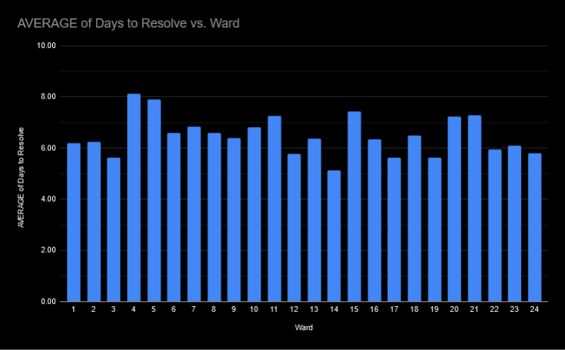
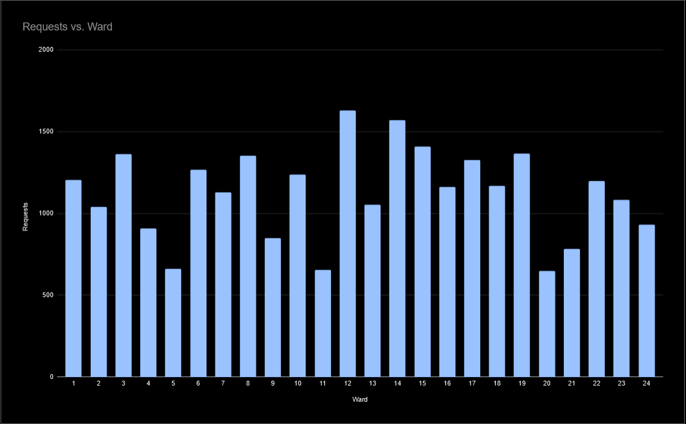

**17/10/2024**<br>
**MPAD 2003-A INTRODUCTION TO DATA STORYTELLING**<br>
**Fedja Osmanovic**<br>
**Presented to Jean-Sébastien Marier**<br>

# Midterm Project: Exploratory Data Analysis (EDA)

## Foreword

This project focuses on conducting an Exploratory Data Analysis (EDA) of a dataset comprising service requests made by Ottawa residents during the month of August 2024. 
The data, sourced from the City of Ottawa's open data portal, contains records of service requests ranging from maintenance issues to public concerns.

Throughout this analysis, various data cleaning and visualization techniques have been applied, and several hypothosis formed

To assist in completing this project, I utilized the following resources:

* City of Ottawa Open Data Portal
* Google Sheets for data cleaning and analysis
* CTV News article for context on Ottawa's rural and urban service distribution
* Weekly readings
* VS Code, for markdown
* Github to host this project

## 1. Introduction

This assignment will analyze a subset from the City of Ottawa's 2024 Service Requests dataset. The dataset contains information regarding the service requests made by 
Ottawa residents, and range from maintenance issues, to public concerns recorded through the month of August. The data was collected by the City of Ottawa's public 
service departments and made available through the city's open data portal.

The dataset analyzed has been cut down from 251,714 and filtered to only use cases from August to make it more manageable for this project. This subset will be used 
to explore service trends and identify potential stories within the data. My analysis will involve data cleaning, exploration, and visualization to provide insights 
into the types of service requests, their frequency, and patterns across different categories.

Open Ottawa Dataset: [Link](https://open.ottawa.ca/documents/65fe42e2502d442b8a774fd3d954cac5/about)

Github CSV: [Link](https://raw.githubusercontent.com/jsmarier/course-datasets/refs/heads/main/ottawa-311-service-requests-august-2024.csv)

## 2. Getting Data

To import this data into Google Sheets it can be done one of two ways. The first of which being through the `IMPORTDATA` function from the first cell of the Sheet. The full code being: <br>
```
=IMPORTDATA(“https://raw.githubusercontent.com/jsmarier/course-datasets/refs/heads/main/ottawa-311-service-requests-august-2024.csv”)
```
<br>

However, since the data is far too large to be done by this function it has to be manually imported. To manually import the data it must first be downloaded from the provided sources and then uploaded directly to the Goolge Sheet. 

To directly import, once a google sheet is created:
1. I go to `File > Import`
1. From here I selected `Upload` and chose the file from my File Explorer.
1. Once uploaded, I finalized by selecting to `Replace existing sheet` and then `IMPORT DATA`.<br>

Here is the result:
<br>
*Figure 1: The Google Sheet after file import. Accessible here: [Link](https://docs.google.com/spreadsheets/d/1DZ_8WAwUQt81wDHo3FmGwdme0gsA9-wrkjvgRc454_k/edit?usp=sharing).*
<br>

Regarding this spreadsheet, it contains 28,538 rows and 11 columns. <br>

It holds data for Service requests. Their IDs, the status of the request, its description, open & close date, address, longitude, latitude, ward, and channel
Overall, the data appears to be relatively clean. However a numerous number of entries are missing under the Address column.

We can note that in Column B, the dataset uses nominal variables to denote the `Status` of any given request; Active, Resolved, or Canceled. Likewise, the `Type` (Column C), `Description` (Column D), and `Address` (Column G), too are nominal. 

The `Service Request ID` (Column A) variable is discrete. A unique numeric identifier for each service request that cannot be further broken down. `Longitude` (Column I), and `Latitude` (Column H) are indiscreet variables as there is an infinite set of possible values. 

Important ordinal variables are also present. Recorded through `Opened Date` (Column E), and `Closed Date` (Column F) in regards to the Service Request.

### Hypothosis

* Service Request resolution time varies by request Type.
* The number of canceled Service Requests is higher for certain types of requests.
* The day of the week plays a role in the frequency of Service Requests made. 

## 3. Understanding Data

### 3.1. VIMO Analysis

**Valid**<br>
The Status values are all completely valid, and contain only expected categories (Resolved, Active, or Canceled). Every entry under this column fits into one of these nominal categories. 
This can be checked by counting and summing up each instance of the three expected categories and verifying it adds up to 28,538.
```
=COUNTIF(range, criterion)
```
And then 
```
=SUM(range of previous countifs)
```

Additionally, the `Opened Date` column's values all range logically from the start of August to the first of September, falling within the expected boundary of this dataset's sample.
Checking whether or not an entry is a date can be done with the `ISDATE()` function provided by Google Docs Editor Help.
```
=ISDATE(E2:E)
```
If any of the 'dates' under `Opened Date` were invalid, False would be returned.
Same applies for `Closed Date`, however it cannot be performed here as some requests are still ongoing.
<br>

**Invalid**<br>
Some cells under the wards column lack any real value, or are not recorded which is outside of the expected entries. Likewise, some addresses along with their 
longitude and latitude hold invalid values<br>

**Missing**<br>
There are few notable instances where missing data comes up. The first of which being in the `Closed Date` column.
The `Closed Date` column has 3,020 missing values. However, these missing values align with the number of `Active` cases. This makes sense as they wouldn't have a 
closing date, effectively excusing them as ‘missing'.
<br>By using:
```
=COUNTIF(B2:B, "Active")
```
And comparing to:
```
=COUNTIF(F2:F, "\N")
```
 We check to see if the same two numbers are returned.
 *They both return 3,020.*<br>


### 3.2. Cleaning Data
<br>
*Figure 2: Cleaned Dataset after below mentioned changes.*

Though the data itself is valid, it appears very clustered when presented as is on the spreadsheet. 
To begin with cleaning I used Sheet's built in Data cleanup under `Data > Data cleanup > Trim whitespaces` to, as suggested, trim any whitespaces. 
On top of this, under `Data > Data cleanup > Remove duplicates` to remove any potential duplicate IDs and their rows under the Service Request ID column. 
This will ensure integrity of any observations drawn from the dataset as each unique entry will not be counted more than once. 
Next, I wanted to shorten the length of data shown in each cell under description as they are very lengthy including both French and English. 
To do this I created two new columns right of the description and used the split function: 
```
[=SPLIT(D2, “|”)]
```
This separates the English and French strings into two different columns.
To preserve the data, but remove it from sight without being destructive, I simply hid the original column, and the French since I'm working in English.
Additionally the row of categories was frozen along the top of the sheet so as to not have to go up to the top of the long dataset for a reminder of what belongs under which category.
I also hid the address, longitude, and latitude columns as they won't be necessary at the moment.


### 3.3. Exploratory Data Analysis (EDA)

Beginning my exploratory data analysis I chose to address my first hypothesis: Service Request resolution time varies by request Type. 

To do this I made a new column to count how long each request took to be resolved in days. Request Type categorizes the services, while Resolution Time quantifies how long it took to resolve each case.
These variables are needed to directly explore the hypothesis.
<br>
*Figure 3: Formula for finding difference between Opened and Closed Date.*

Using the formula:
```
=IF(H2="\N", "\N", H2 - G2)
```
This gives us for each Service Request how many days it took to resolve it, while accounting for cases yet to be resolved.
From here I used a  pivot table to calculate the average amount of time it took for each different type of service request to be resolved.

<br>
*Figure 4: This pivot table shows the average amount of days taken to resolve each request type, and its setup.*

In the pivot table's settings, choosing Request Type as the rows and then adding the value to be the average of days taken to resolve. Formatting the value to 2 decimal places.

#### Notable Statistics:


*Figure 5: This chart shows the relation between average days taken to resolve and request types.*

I thought a bar chart would be most appropriate as Statistics Canada suggests "Bar charts should be used when you are showing segments of information. Vertical bar charts are useful to compare different categorical or discrete variables.", and "Type of Request" is distinct and non-continuous.

Social Community Service requests have the longest average resolution time (13.18 days), standing out significantly compared to other types.
Parking Control Enforcement requests are resolved extremely quickly, with an average of only 0.41 days.
Health and Safety and Garbage and Recycling are resolved fairly quickly (4.94 and 5.72 days on average).

* Social Community Service (13.18 days) and Citizen Services (11.19 days): These types of requests are likely more complex and may involve multiple steps or agencies.
* Licenses and Permits (9.14 days): Permit and licensing processes often involve thorough checks, documentation, and identification, likely contributing to a longer resolution time.
* Health and safety (4.94 days): These requests look to be prioritized because they can directly affect the well-being of citizens, while still having some layer of complexity 
* Parking Control Enforcement (0.41 days): These are probably resolved almost instantly as things like parking control, or ticket disputes are routine tasks that require minimal resources to execute and resolve.


The data shows a clear variation in resolution times depending on the type of service request. Some types, such as Social Community Service, seem to take much 
longer to resolve, while others, like Parking Control Enforcement, are handled almost immediately. This could reflect the complexity or priority of different 
service requests. The story here could revolve around the efficiency and prioritization of different city services. Standing out, why are some services resolved 
almost immediately, while others take upwards of a week?

This could potentially further be explored by analyzing the ward in which service requests are made, as well as comparing resolution times 
to their respective wards. Analyzing frequency in wards, alongside the request type would allow us to identify potential patterns in service 
requests and resolution efficiency across different areas of the city. Additionally, comparing the average resolution times between wards can 
reveal disparities in how quickly services are being provided across the city. For instance, some wards may experience quicker response times 
due to higher resource allocation

As suggested in Datajournalism.com's 5 Minute Fieldguide, "A lot of data is kept in multiple departments and while for one, a particular database 
may be their crown jewels, another may give it to you freely." suggesting we could potentially find other datasets elsewhere for additional relevant 
data about budget allocations, resource distribution, and population density across wards.

## 4. Potential Story

<br>
*Figure 6: Average time taken to resolve issue by Ward*

<br>
*Figure 7: Requests per Ward*

We could further explore the potential disparities in service delivery across different wards, focusing on how certain areas of the city may experience 
slower response times. Maybe due to a lack of resources, staff shortages, or higher demands. To tell this story, I'd  need more detailed data like budget 
and resource allocation for each ward, as well as population density. This would help reveal whether wealthier or more populated wards receive faster service compared to others.


Ideally, interviews with city councilors from different wards could shed light on their respective local challenges. Speaking to city department heads 
responsible for managing services like Roads and Transportation, Garbage and Recycling, and Bylaw Services could also provide insight into differences 
in resource allocation. 


In one article on CTVNews the Rural Summit announcement emphasizes that 80% of Ottawa is rural, yet rural communities often feel overlooked in terms of 
services. One of the key concerns raised at the summit was the lack of resources and attention given to rural wards compared to urban ones. A West Carleton 
resident noting “We don't have a large population, but we have a large rural area by landmass, but as a result, we're not really being focused on,”(CTVNews, 2024). 
Following up with the same article I think it would be good to interview councillors like David Brown or Clarke Kelly, who spoke about how rural areas need different 
service strategies. They'd provide valuable perspectives. These representatives could explain any historical challenges rural wards faced in receiving services, such 
as delayed responses to garbage collection or road maintenance. 


## 5. Conclusion

Going into this assignment I felt a little intimidated. I knew it was key to have the data organized, so that's where I wanted to start. Though, I never really enjoyed 
dealing with data and spreadsheets, and then this one seemingly large to my perspective was overwhelming. However, with everything we've been learning, and then having 
a chance to sit down and wrangle with the data myself, everything ended up being fine, satisfying even. I grew much more comfortable with traversing it and finding what 
I needed within it.


In terms of challenge the most difficult part was probably setting up the first pivot table. It was the thing I was most unfamiliar with, and I had to go back to refresh 
myself on how to use them. If we're not counting the familiarization of pivot tables, by far the most rewarding part of dealing with that data was watching each cell fill 
with the appropriate data after executing a function, and not being an error or invalid value, put together with then using this data. Writing in markdown was also fairly chaotic.   

In the future I'd like to explore the rest of the formed hypothesis, and go further in depth with the analysis. Perhaps covering multiple datasets as mentioned to come up 
with the most accurate conclusions.


## 6. References

A five minute field guide. DataJournalism.com. (n.d.). https://datajournalism.com/read/handbook/one/getting-data/a-five-minute-field-guide 


Google. (n.d.). ISDATE function. Google Docs Editors Help. https://support.google.com/docs/answer/9061381?hl=en 


Government of Canada, S. C. (2021, September 2). 5 Data Visualization 5.2 Bar Chart. 5.2 Bar chart. https://www150.statcan.gc.ca/n1/edu/power-pouvoir/ch9/bargraph-diagrammeabarres/5214818-eng.htm 


Mazloum, T. (2024, November 2). Mayor Sutcliffe announces 10 new initiatives to improve the quality of life for rural Ottawa residents. Ottawa. https://ottawa.ctvnews.ca/mayor-sutcliffe-announces-10-new-initiatives-to-improve-the-quality-of-life-for-rural-ottawa-residents-1.7096599 
