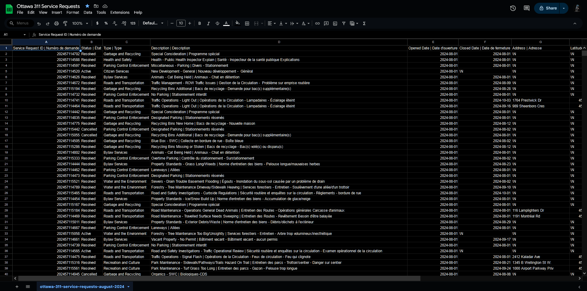
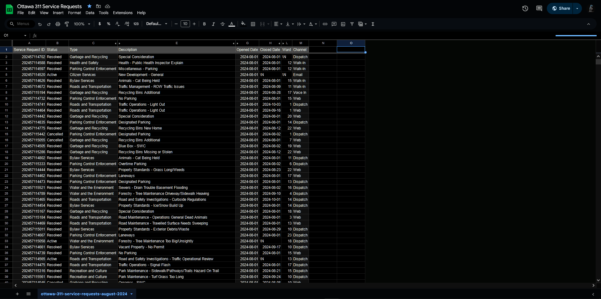

**17/10/2024**<br>
**MPAD 2003-A INTRODUCTION TO DATA STORYTELLING**<br>
**Fedja Osmanovic**<br>
**Presented to Jean-Sébastien Marier**<br>

# Midterm Project: Exploratory Data Analysis (EDA)

Use one hashtag symbol (`#`) to create a level 1 heading like this one.

## Foreword

For this assignment, you must extract data from a dataset provided by the instructor. You must then clean and analyze the data, create exploratory charts/visualizations, and find a potential story idea. Your assignment must clearly detail your process. You are expected to write about 1500-2000 words, and to include several screen captures showing the different steps you went through. Your assignment must be written with the Markdown format and submitted on GitHub Classroom.

I have been assigning different versions of this project to my digital journalism and data storytelling students for a few years now. Its structure was inspired by the main sections/chapters of [*The Data Journalism Handbook*](https://datajournalism.com/read/handbook/one/). This version was further inspired by the [Key Capabilities in Data Science](https://extendedlearning.ubc.ca/programs/key-capabilities-data-science) program offered by the University of British Columbia (UBC).

**Here are some useful resources for this assignment:**

* [GitHub's *Basic writing and formatting syntax* page](https://docs.github.com/en/get-started/writing-on-github/getting-started-with-writing-and-formatting-on-github/basic-writing-and-formatting-syntax)
* [The template repository for this assignment in case you delete something by mistake](https://github.com/jsmarier/jou4100_jou4500_mpad2003_project2_template)

Did you notice how to create a hyperlink? In Markdown, we put the clickable text between square brackets and the actual URL between parentheses.

And to create an unordered list, we simply put a star (`*`) before each item.

## 1. Introduction

This assignment will analyze a subset from the City of Ottawa’s 2024 Service Requests dataset. The dataset contains information regarding the service requests made by Ottawa residents, and range from maintenance issues, to public concerns recorded through the month of August. The data was collected by the City of Ottawa's public service departments and made available through the city’s open data portal.

The dataset analyzed has been cut down from 251,714 and filtered to only use cases from August to make it more manageable for this project. This subset will be used to explore service trends and identify potential stories within the data. My analysis will involve data cleaning, exploration, and visualization to provide insights into the types of service requests, their frequency, and patterns across different categories.

Open Ottawa Dataset: [Link](https://open.ottawa.ca/documents/65fe42e2502d442b8a774fd3d954cac5/about)

Github CSV: [Link](https://raw.githubusercontent.com/jsmarier/course-datasets/refs/heads/main/ottawa-311-service-requests-august-2024.csv)

## 2. Getting Data

To import this data into Google Sheets it can be done one of two ways. The first of which being through the `IMPORTDATA` function from the first cell of the Sheet. The full code being: <br>
```
=IMPORTDATA(“https://raw.githubusercontent.com/jsmarier/course-datasets/refs/heads/main/ottawa-311-service-requests-august-2024.csv”)
```
<br>

However, since the data is far too large to be done by this function it has to be manually imported. To manually import the data it must first be downloaded from the provided sources and then uploaded directly to the Goolge Sheet. 

To directly import, once a google sheet is created:
1. I go to `File > Import`
1. From here I selected `Upload` and chose the file from my File Explorer.
1. Once uploaded, I finalized by selecting to `Replace existing sheet` and then `IMPORT DATA`.<br>

Here is the result:
<br>
*Figure 1: The Google Sheet after file import. Accessible here: [Link](https://docs.google.com/spreadsheets/d/1DZ_8WAwUQt81wDHo3FmGwdme0gsA9-wrkjvgRc454_k/edit?usp=sharing)*
<br>

Regarding this spreadsheet, it contains 28,538 rows and 11 columns. <br>

It holds data for Service requests. Their IDs, the status of the request, its description, open & close date, address, longitude, latitude, ward, and channel
Overall, the data appears to be relatively clean. However a numerous number of entries are missing under the Address column.

We can note that in Column B, the dataset uses nominal variables to denote the `Status` of any given request; Active, Resolved, or Canceled. Likewise, the `Type` (Column C), `Description` (Column D), and `Address` (Column G), too are nominal. 

The S`ervice Request ID` (Column A) variable is discrete. A unique numeric identifier for each service request that cannot be further broken down. `Longitude` (Column I), and `Latitude` (Column H) are indiscreet variables as there is an infinite set of possible values. 

Important ordinal variables are also present. Recorded through `Opened Date` (Column E), and `Closed Date` (Column F) in regards to the Service Request.

### Hypothosis

* Service Request resolution time varies by request Type.
* The number of canceled Service Requests is higher for certain types of requests.
* The day of the week plays a role in the frequency of Service Requests made. 

## 3. Understanding Data

### 3.1. VIMO Analysis

**Valid**<br>
The Status values are all completely valid, and contain only expected categories (Resolved, Active, or Canceled). Every entry under this column fits into one of these nominal categories. 
This can be checked by counting and summing up each instance of the three expected categories and verifying it adds up to 28,538.
```
=COUNTIF(range, criterion)
```
And then 
```
=SUM(range of previous countifs)
```

Additionally, the `Opened Date` column's values all range logically from the start of August to the first of September, falling within the expected boundary of this dataset's sample.
Checking whether or not an entry is a date can be done with the `ISDATE()` function.
```
=ISDATE(E2:E)
```
If any of the 'dates' under `Opened Date` were invalid, False would be returned.
Same applies for `Closed Date`, however it cannot be performed here as some requests are still ongoing.
<br>

**Invalid**<br>
Some cells under the wards column lack any real value, or are not recorded which is outside of the expected entries. Likewise, some addresses along with their longitude and latitude hold invalid values<br>

**Missing**<br>
There are few notable instances where missing data comes up. The first of which being in the `Closed Date` column.
The `Closed Date` column has 3,020 missing values. However, these missing values align with the number of `Active` cases. This makes sense as they wouldn’t have a closing date, effectively excusing them as ‘missing’.
<br>By using:
```
=COUNTIF(B2:B, "Active")
```
And comparing to:
```
=COUNTIF(F2:F, "\N")
```
 We check to see if the same two numbers are returned.
 *They both return 3,020.*<br>

<br>

**Outliers**<br>
asd<br>

!!!!!!!!!!!!!!!!!Support your claims by citing relevant sources. Please follow [APA guidelines for in-text citations](https://apastyle.apa.org/style-grammar-guidelines/citations).

**For example:**

As Cairo (2016) argues, a data visualization should be truthful...

### 3.2. Cleaning Data

*Cleaned Dataset after below mentioned changes*

Though the data itself is valid, it appears very clustered when presented as is on the spreadsheet. 
To begin with cleaning I used Sheet's built in Data cleanup under `Data > Data cleanup > Trim whitespaces` to, as suggested, trim any whitespaces. 
On top of this, under `Data > Data cleanup > Remove duplicates` to remove any potential duplicate IDs and their rows under the Service Request ID column. 
This will ensure integrity of any observations drawn from the dataset as each unique entry will not be counted more than once. 
Next, I wanted to shorten the length of data shown in each cell under description as they are very lengthy including both French and English. 
To do this I created two new columns right of the description and used the split function: 
```
[=SPLIT(D2, “|”)]
```
This separates the English and French strings into two different columns.
To preserve the data, but remove it from sight without being destructive, I simply hid the original column, and the French since I’m working in English.
Additionally the row of categories was frozen along the top of the sheet so as to not have to go up to the top of the long dataset for a reminder of what belongs under which category.
I also hid the address, longitude, and latitude columns as they won’t be necessary at the moment.


### 3.3. Exploratory Data Analysis (EDA)

Insert text here.

**This section should include a screen capture of your pivot table, like so:**

<br>
*Figure 2: This pivot table shows...*

**This section should also include a screen capture of your exploratory chart, like so:**

<br>
*Figure 3: This exploratory chart shows...*

## 4. Potential Story

Insert text here.

## 5. Conclusion

Insert text here.

## 6. References

Include a list of your references here. Please follow [APA guidelines for references](https://apastyle.apa.org/style-grammar-guidelines/references). Hanging paragraphs aren't required though.

**Here's an example:**

Bounegru, L., & Gray, J. (Eds.). (2021). *The Data Journalism Handbook 2: Towards A Critical Data Practice*. Amsterdam University Press. [https://ocul-crl.primo.exlibrisgroup.com/permalink/01OCUL_CRL/hgdufh/alma991022890087305153](https://ocul-crl.primo.exlibrisgroup.com/permalink/01OCUL_CRL/hgdufh/alma991022890087305153)
